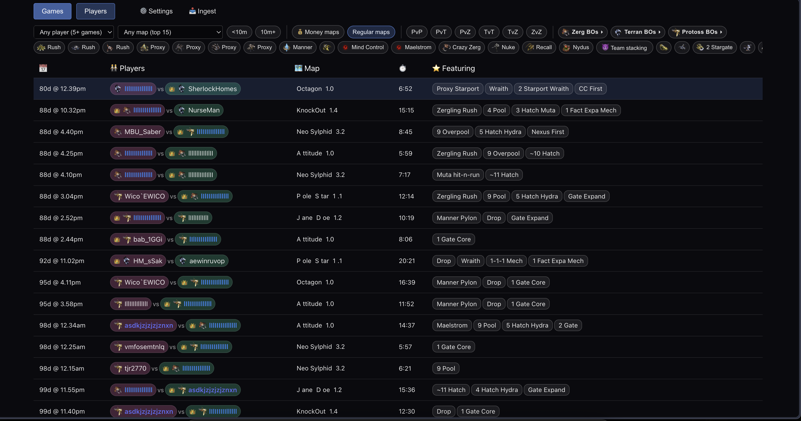
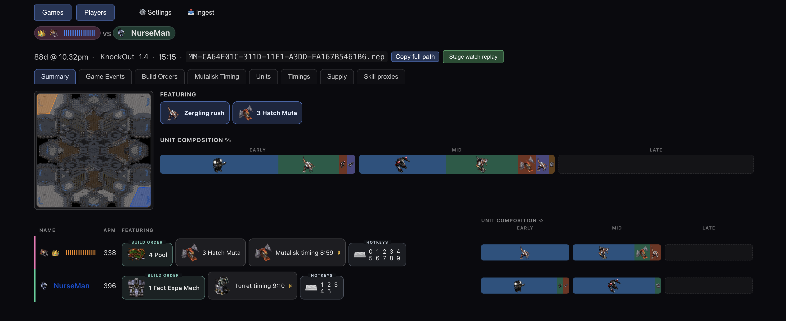
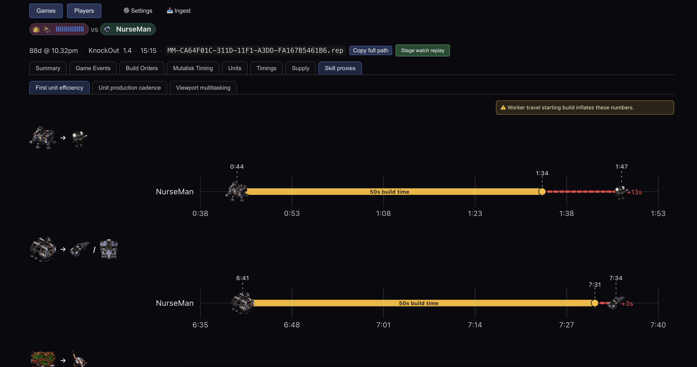

# screpdb

screpdb is an advanced Starcraft replay reporting tool.

[](https://github.com/marianogappa/screpdb/releases)
[](LICENSE)
[](go.mod)
[](scripts/coverage.sh)
[](.github/workflows/bench-ingest.yml)

<!-- ingest-bench-start -->
<sub>212.43 ms/replay · corpus: 150 replays · GitHub-hosted 2-core runner · updated automatically on merge to main</sub>
<!-- ingest-bench-end -->

## Features
### Filtering/finding replays by high-level semantic features


### Game summary, with one-click staging of a replay for watching on the game client


### Rich game events browser with map overlays


###  Build Order detection with charts and for comparing with progamer timings


###  Skill proxies measurements: Viewport Multitasking, Unit Production Cadence, First Unit Efficiency


###  Alias list support for progamer replays (built-in, editable, importable/exportable), and automatic aliasing for local user's player names


### Sophisticated command de-duping on the early game to facilitate precise build order detection and timing comparisons


### Alliance timeline and team stacking detection on multiplayer melee games


## Installation

See [CHANGELOG.md](CHANGELOG.md) for release notes.

> ⚠️ **Security:** On **Windows**, screpdb runs its worker at **Low integrity** — the OS confines all of screpdb's writes to a single app-data folder, so even a compromised replay/map parser cannot write elsewhere on your machine (see [Security / I/O model](#security--io-model)). On **macOS and Linux** there is no OS sandbox yet: screpdb routes all its own I/O through in-process facades (writes confined to the app-data dir and the replays folder, no outbound network calls beyond user-initiated self-update), but these are best-effort guardrails rather than an OS boundary, so exercise judgement before running it.

<details>
<summary><strong>Windows</strong> — recommended: install with Scoop</summary>

**👉 Recommended: install with [Scoop](https://scoop.sh).** Open **PowerShell** and paste these two commands:

```powershell
scoop bucket add screpdb https://github.com/marianogappa/screpdb
scoop install screpdb
```

That's it. Now run **`screpdb-gui`** (the app opens in your browser), or `screpdb` for the CLI.

To upgrade later, just run:

```powershell
scoop update screpdb
```

Scoop is the happy path because it downloads without a browser, so Windows **won't** show the "unidentified developer" / SmartScreen warning, and upgrades are one command. Don't have Scoop yet? Install it first (one line, from [scoop.sh](https://scoop.sh)):

```powershell
Set-ExecutionPolicy -ExecutionPolicy RemoteSigned -Scope CurrentUser
irm get.scoop.sh | iex
```

<details>
<summary>Prefer a direct download? (expect a SmartScreen warning)</summary>

Grab **`screpdb-gui-windows-amd64.exe`** (the GUI; `screpdb-windows-amd64.exe` is the CLI) from the [Releases page](https://github.com/marianogappa/screpdb/releases) and double-click it.

The binaries are **not code-signed**, so on first launch Windows may warn you — none of these mean the binary is malicious:

- **SmartScreen "Windows protected your PC".** Click **More info → Run anyway**.
- **Microsoft Defender or third-party antivirus** may flag or silently quarantine the binary. Unsigned Go binaries that read files and make network requests are a known false-positive pattern. If the file vanishes from Downloads, check Defender's Protection History and restore it (or add an exclusion).
- **Enterprise machines** running AppLocker or Windows Defender Application Control may block it outright. There's no workaround without code signing.

The GUI binary is a windowed app with no console — if you dismiss the SmartScreen dialog it simply won't start and won't print an error. Scoop avoids all of this. You can also [build from source](#building-from-source).

> 💡 **Want the in-app Update button to work?** Put the `.exe` in a folder you can write to without admin rights — e.g. create `%LOCALAPPDATA%\Programs\screpdb\` and drop it there. screpdb can only replace its own binary when its folder is user-writable, so `C:\Program Files\` (needs admin) won't self-update. Otherwise the app just shows the download link instead.

</details>

The Scoop manifest lives at [`bucket/screpdb.json`](bucket/screpdb.json) and is bumped automatically on each release.

</details>

<details>
<summary><strong>Linux</strong> — one-line installer, or Homebrew</summary>

**Install with one command** (downloads the right binary, verifies it against the release's signed `SHA256SUMS`, drops it on your PATH):

```bash
curl -fsSL https://raw.githubusercontent.com/marianogappa/screpdb/main/install.sh | sh
```

Then run `screpdb`. To upgrade, re-run the same command (or use the in-app **Update** button).

> 🔍 **Don't pipe scripts you haven't read.** [`install.sh`](install.sh) is deliberately short and dependency-free so you can audit it in under a minute — it only downloads the binary for your OS/arch, checks it against the release's signed `SHA256SUMS`, and copies it to `~/.local/bin`. To read it first, then run your local copy:
>
> ```bash
> curl -fsSL https://raw.githubusercontent.com/marianogappa/screpdb/main/install.sh -o screpdb-install.sh
> less screpdb-install.sh   # audit it
> sh screpdb-install.sh
> ```

Prefer **[Homebrew](https://brew.sh) / Linuxbrew**?

```bash
brew install marianogappa/screpdb/screpdb   # upgrade later: brew upgrade screpdb
```

Or download the binary for your architecture from the [Releases page](https://github.com/marianogappa/screpdb/releases), make it executable, and move it onto your `PATH` — put it in a writable folder (not a Homebrew prefix) so the in-app **Update** button works:

```bash
chmod +x screpdb-linux-amd64                              # or screpdb-linux-arm64
mkdir -p ~/.local/bin && mv screpdb-linux-amd64 ~/.local/bin/screpdb
```

`~/.local/bin` is the one-line installer's default — any writable folder on your `PATH` works. Binaries fetched via curl/brew carry no quarantine flag, so they just run.

> 💡 screpdb self-updates only when its folder is user-writable and not owned by a package manager. A binary you run from `~/Downloads` or a Homebrew prefix won't auto-update — the app falls back to showing the download command instead.

</details>

<details>
<summary><strong>macOS</strong> — Homebrew, or one-line installer</summary>

**Install with [Homebrew](https://brew.sh):**

```bash
brew install marianogappa/screpdb/screpdb   # upgrade later: brew upgrade screpdb
```

Or the one-line installer (verifies it against the release's signed `SHA256SUMS`, installs to `~/.local/bin`):

```bash
curl -fsSL https://raw.githubusercontent.com/marianogappa/screpdb/main/install.sh | sh
```

Wary of piping to `sh`? It's the same [`install.sh`](install.sh) shown in the Linux section above — read it first, then run your local copy.

Then run `screpdb`. **No Gatekeeper "unidentified developer" block** with either method — `brew` and `curl` don't attach the quarantine attribute that triggers it, so the binary just runs (no notarization needed).

<details>
<summary>Prefer a direct download? (this one <em>does</em> hit Gatekeeper)</summary>

Download the binary for your architecture from the [Releases page](https://github.com/marianogappa/screpdb/releases), then clear the quarantine flag and move it onto your `PATH` — a writable folder (not a Homebrew prefix) so the in-app **Update** button works:

```bash
chmod +x screpdb-darwin-arm64                          # or screpdb-darwin-amd64
xattr -d com.apple.quarantine screpdb-darwin-arm64     # clear the browser-download quarantine
mkdir -p ~/.local/bin && mv screpdb-darwin-arm64 ~/.local/bin/screpdb
```

(Or right-click the binary → **Open** to approve it once.) `~/.local/bin` matches the one-line installer's default.

> 💡 screpdb self-updates only when its folder is user-writable and not owned by a package manager. A binary you run straight from `~/Downloads` or a Homebrew prefix won't auto-update — the app falls back to showing the download command instead.

</details>

</details>

### Building from source

You'll need Go 1.25.2 or later. Use `make build` (not a bare `go build`) so the embedded dashboard UI assets are rebuilt first:

```bash
git clone https://github.com/marianogappa/screpdb.git
cd screpdb
make build
```

## Developer features

<details>
<summary>CLI ingestion, MCP server, and full OpenAPI — click to expand</summary>

- CLI for ingestion onto SQLite database. No need to use UI: just ingest and query the database.

```bash
./screpdb ingest

- `-i, --input-dir`: Input directory containing replay files (default: system replay directory)
- `-s, --sqlite-path`: SQLite database file path (default: screp.db)
- `-n, --stop-after-n-reps`: Stop after processing N replay files (0 = no limit)
- `-d, --up-to-yyyy-mm-dd`: Only process files up to this date (YYYY-MM-DD format)
- `-m, --up-to-n-months`: Only process files from the last N months (0 = no limit)
- `--store-right-clicks`: Store `Right Click` commands (disabled by default to reduce command-table volume)
- `--skip-hotkeys`: Skip storing `Hotkey` commands (disabled by default)
- `--clean`: Drop all non-dashboard tables before ingesting to start over (useful for migrations)
```

- MCP server: point an MCP client (Claude Desktop, Claude Code, Cursor, …) at the replay database and ask questions in natural language about any game, player, matchup, build order, or event. The client's model turns your question into read-only SQL over the ingested data. The server exposes tools to run queries (`query_database`), inspect the schema (`get_database_schema`), read StarCraft domain knowledge (`get_starcraft_knowledge`), and discover players and derived events (`list_top_players`, `list_event_types`).

```bash
./screpdb mcp

# Specify custom database file
./screpdb mcp -s /path/to/custom.db
```

- Server / API: `./screpdb dashboard` (also the default when run with no subcommand) starts the HTTP server and opens the dashboard UI. All UI functionality is exposed as a JSON API — [OpenAPI schema available](api/openapi/dashboard.v1.yaml). Run it headless as an API-only server (no UI, no browser) with `--headless`:

```bash
./screpdb dashboard --headless -p 8000 -s /path/to/custom.db
# then: curl http://localhost:8000/api/health
```

</details>

## Specification — how the numbers are computed

<details>
<summary>Every golden value — unit stats, build times, expert timings, detection thresholds — is generated from source and test-backed (see <code>SPECIFICATION.md</code>)</summary>

screpdb makes a lot of derived claims: "this is a **9 Pool**", "your Spawning
Pool was 6s late", "a Zealot takes 25.2s". Skeptical? Audit them.

[**SPECIFICATION.md**](SPECIFICATION.md) documents every golden value the app
relies on — unit names, build times, expert timings, costs, tech-tree rules,
detection thresholds, and more. It's:

- **Generated** from the Go source of truth (`go generate ./...`), so it can't drift from the code.
- **Test-backed** — CI fails if any value is wrong or the file is stale.

In short: not aspirational docs that rot, but a provably-accurate description of
what the app actually does.

</details>

<details>
<summary><strong>Verifying downloads</strong> — checksums + minisign signature</summary>

Each release publishes a `SHA256SUMS` file and a `SHA256SUMS.minisig` minisign signature alongside the binaries.

**Verify the checksum** (Linux/macOS):

```bash
sha256sum -c SHA256SUMS --ignore-missing
```

**Verify the checksum** (Windows PowerShell):

```powershell
Get-FileHash screpdb-windows-amd64.exe -Algorithm SHA256
# Compare the printed hash against the line in SHA256SUMS
```

**Verify the signature** (requires [minisign](https://jedisct1.github.io/minisign/)):

```bash
minisign -Vm SHA256SUMS -P 'RWS9gPPOydPD/tR8JBOelXKhif526NoAKY18dau7QHR4dqg84QMhJ5L/'
```

</details>

## Security / I/O model

screpdb minimizes its attack surface by routing all I/O through facades and keeping dependencies small (see [#135](https://github.com/marianogappa/screpdb/issues/135)). On **macOS and Linux** this is a best-effort, in-process guard; on **Windows** a Low-integrity worker adds a real OS write boundary.

<details>
<summary><strong>How the I/O model works</strong> — filesystem, Windows sandbox, network, self-update, enforcement</summary>

- **Filesystem** — all disk access goes through `internal/iofacade`, which permits reads/writes only within: a single per-OS **app-data directory** (`%LOCALAPPDATA%\screpdb` on Windows, `~/Library/Application Support/screpdb` on macOS, `$XDG_CONFIG_HOME/screpdb` on Linux) that holds the SQLite database, game-asset cache, logs, crash reports, and extracted sample replays; and the configured replays folder (read replays, write "watch me" replays). A narrow, read-only exception walks up from the replays folder to find StarCraft's `CSettings.json`.
- **Windows OS sandbox** — on Windows the app splits into a Medium-integrity **launcher** and a **Low-integrity worker** ([#237](https://github.com/marianogappa/screpdb/issues/237)). The launcher marks the app-data directory Low-writable and relaunches the real worker at Low integrity; the worker keeps read-down access to replays anywhere but can only *write* into that one Low-labeled folder — every other write is refused by the OS, even from a compromised `screp`/`scmapanalyzer` parser. The launcher retains self-update (it must overwrite the install `.exe`) and brokers the single "watch me" write into the read-only replays folder on the worker's behalf. This does **not** stop a compromised parser from *reading* private files (Low integrity can read up-level); blocking reads needs AppContainer + a broker process, a deferred "Tier 2" follow-up.
- **Network** — the dashboard server binds to `localhost` only. The binary's only outbound calls are to **GitHub Releases for self-update** ([#212](https://github.com/marianogappa/screpdb/issues/212)): on launch it reads the latest release to surface an update notice, and — only when you click Update — it downloads the matching asset. Every downloaded byte is verified against a minisign-signed `SHA256SUMS` (embedded public key) before the binary is swapped, so a tampered or man-in-the-middled download is rejected regardless of which host served it. All of this lives in the single sanctioned `internal/selfupdate` package; `internal/netfacade` houses the only other network-client operation (a localhost readiness probe).
- **Self-update** — updates are always user-initiated, never automatic. Package-manager installs (Scoop on Windows, Homebrew/Linuxbrew on macOS/Linux) and non-writable install directories are detected and excluded so the updater never fights `scoop update` / `brew upgrade` or needs elevation; those installs are pointed back at their package manager. The `curl | sh` installer drops into a writable dir (`~/.local/bin`), so in-app self-update keeps working there. Self-written binaries carry no macOS quarantine xattr / Windows Mark-of-the-Web, so Gatekeeper/SmartScreen don't re-prompt after an update.
- **Enforcement** — `TestNoDirectIOOutsideFacades` (in `internal/iofacade`) parses the whole module on every `go test` run and fails the build if any package reaches the filesystem or network directly instead of through the facades. `internal/selfupdate` and `internal/winsandbox` (the Windows process-spawn / integrity-labeling / broker surface) are the documented exceptions.

On **macOS and Linux** this is a best-effort, in-process guard, not an OS sandbox: paths handed to trusted dependencies (the SQLite driver, the screp parser, scmapanalyzer) are opened inside those libraries, and the facade only constrains screpdb's own code. On **Windows** the Low-integrity worker adds a real OS write boundary on top of the same facades.

</details>

### I/O Safety Audit

The LLM that authors each change records a dated, one-line verdict on whether it could weaken the I/O rules above (see `AGENTS.md`); `TestIOSafetyAuditPresent` fails CI if the log is empty, and the enforcement test above stays the authoritative guard.

<!-- IO-AUDIT:START -->
```
2026-07-04  OK (net reduction in the SQL surface's capability). MCP-server modernization + dashboard headless API mode. MCP: query_database now rejects non-read-only SQL (only SELECT/WITH/EXPLAIN/PRAGMA, single statement, comment-stripped) so an MCP client can no longer mutate the corpus; corrected tool descriptions/annotations, expanded GetDatabaseSchema introspection to replay_events/player_aliases, refreshed the domain-knowledge text, added two read-only discovery tools (list_top_players, list_event_types), and bumped mcp-go v0.41.1→v0.55.1. Dashboard: new `--headless` flag serves the JSON API only (no embedded SPA, no browser-open — one fewer os call in that mode); documented 8 operational endpoints (game-assets, debug map-layout, markers definitions, sample-set load, self-update status/apply) in the OpenAPI spec, excluded from code generation, with the validator middleware deferring method-less spec paths to their hand-written handlers while still returning 405 for genuine wrong-method calls. All DB access stays through the storage/dashboard layer; no new os/net calls, no iofacade/netfacade allowlist widening, no enforcement-test change, no AlgorithmVersion bump (no detection change).
```

<details>
<summary>Older I/O safety audit entries (click to expand)</summary>

```
2026-07-04  OK. Zerg opener supply fix: larva morphs cancelled before the player's first Overlord are dropped from the "N Pool"/"N Hatch" count (a cancelled egg that early is provably a Drone, so it refunds a supply) — fixes e.g. a 5 Pool with a cancelled drone reading as 6 Pool. New commands.DropCancelledMorphs runs on the already-filtered stream in the parser; AlgorithmVersion 58→59 (re-ingest), SPECIFICATION.md regenerated. Reads the in-memory command slice only: no os/net calls, no iofacade/netfacade allowlist widening, no enforcement-test change.
2026-07-04  OK. Beta-exempt the catch-all residual buckets (bo_zerg_other / bo_protoss_other / bo_terran_other / opener_unresolved) so the dashboard stops flagging them "beta" — they claim whatever the named openers leave over, so there is no premise to verify. Added the keys to markers.betaExemptFeatureKeys plus a guard test that every exempt key names a live marker. Display-time curation metadata only (beta tag is computed from FeatureKey at the definitions endpoint): no detection/ingest change, no AlgorithmVersion bump, no os/net calls, no iofacade/netfacade allowlist widening, no enforcement-test change.
2026-07-04  OK. "Update available" UX polish: managed/not-writable installs now show a copyable upgrade command with a Copy button and a Changelog link, the loud (major) banner is dismissable like the quiet one, and the not-writable macOS/Linux case surfaces the `curl | sh` install-script re-run. Go change is additive-only — a new runtime.GOOS-derived `OS` field on selfupdate.Status so the frontend can pick a platform-correct command; plus README direct-download placement tips. No new os/net calls, no iofacade/netfacade allowlist widening, no enforcement-test changes; the self-update mechanism (minisign-verified, user-initiated, writable-dir/package-manager detection) is unchanged.
2026-07-03  OK. Removed the Go Report Card README badge (goreportcard.com no longer rendering it) and added a static coverage badge (81%, from scripts/coverage.sh — generated code excluded). Docs-only: no code, os/net calls, or facade allowlist change.
2026-07-03  OK. Fixed the player-outliers endpoint returning 500 (not 404) for an unknown player: GetOutlierPlayerSummary now COALESCEs the NULL-name aggregate to '' (sqlc query + regenerated sqlcgen). Query/codegen only, still through the dashboard store; no os/net calls, no facade allowlist change.
2026-07-03  OK. scmapanalyzer bumped to v0.0.0-20260702193642 (upstream copyright-only change) + Wraith Cloak timing now reports Cloaking Field completion (start+63s, drops if the game ends first), AlgorithmVersion 58. Dependency/detection only: map analysis still runs through the iofacade allowlist, no os/net calls added, no allowlist widening, no TestNoDirectIOOutsideFacades change; 193 no-cache tests across the scmapanalyzer-dependent packages pass.
2026-07-03  OK. Speedlot-timing now reports Leg Enhancement research completion (and drops when the game ends first) + "9 Pool 9 Hatch" relabel; AlgorithmVersion 57, goldens + SPECIFICATION.md regenerated. Pure detection/pattern logic: no os/net calls, no iofacade/netfacade allowlist change, no TestNoDirectIOOutsideFacades change.
2026-07-03  OK. Toolchain bump to Go 1.26.4 (go.mod go directive) plus a repo-wide gofmt pass. Tooling/formatting only: no os/net calls added, no iofacade/netfacade allowlist widening, no change to the TestNoDirectIOOutsideFacades enforcement.
2026-07-02  OK. README presentation pass, no behaviour change: collapsed the per-OS install sections, baked the measured ingestion-throughput figure into the badge, trimmed the Security/I/O-model prose, and reformatted this audit log into a code block. The TestIOSafetyAuditPresent regex was loosened to also match the new plain-date log line. Docs/test-format only: no os/net calls, no iofacade/netfacade allowlist widening, no change to the TestNoDirectIOOutsideFacades enforcement test.
2026-07-02  OK. Follow-up to #248 (PR #255): dashboard-frontend copy only — for package-manager (Homebrew/Scoop) installs the "update available" control shows the exact upgrade command (brew upgrade screpdb / scoop update screpdb) in its label, renders as a non-link (a download page is useless when the fix is a terminal command), and surfaces it via an instant hover/focus tooltip. No Go changes, no os/net calls, no iofacade/netfacade allowlist widening, no enforcement-test changes.
2026-07-02  OK. BO/marker label render fixes (issue #251) + ingestion-speed benchmark tracking (issue #249). #251 is render-only: a new markers.DecodePayloadLabel decoder resolves the persisted {"label":...} value so the games-list Featuring strip and game-detail openers show "3 Hatch Muta"/"~9 Overpool" instead of the placeholder name — reads existing payloads, no new os/net calls. #249 adds a make bench-ingest target, scripts/bench-ingest.sh / scripts/update-readme-bench.sh, and a bench-ingest.yml workflow — all shell/CI tooling that runs outside the screpdb binary (not part of the Go module the enforcement test parses), plus a checksum-dedup guard in the existing storage benchmark test. No iofacade/netfacade allowlist widening, no enforcement-test changes.
2026-07-02  OK. Free first-install UX for macOS/Linux + GUI asset rename (issue #248). New files are the standalone install.sh (curl | sh installer) and scripts/update-homebrew-formula.sh/.github release wiring — these run outside the screpdb binary (they are shell installers/CI, not part of the Go module the enforcement test parses), so they touch no iofacade/netfacade surface. In-binary Go changes are a pure rename: the Windows GUI release asset screpdb-dashboard-windows-amd64.exe → screpdb-gui-windows-amd64.exe and the buildinfo.Variant value dashboard → gui (self-update asset-name string in internal/selfupdate + a one-line dashboard-frontend message), plus the GUI log file screpdb-dashboard.log → screpdb-gui.log. No new os/net calls, no iofacade/netfacade allowlist widening, no enforcement-test changes. Self-update mechanism is unchanged (still minisign-verified, user-initiated); the curl/Homebrew install paths reuse the existing package-manager / writable-dir detection.
2026-07-02  OK (with a deliberate, documented allowlist change + one new sanctioned surface). Windows Low-integrity sandbox (issue #237). Filesystem: writes are consolidated under a single per-OS app-data root via the new internal/appdata package (DB, game-asset cache, logs, crash reports, sample replays) — the iofacade allowlist changes, not widens: the working-directory and OS-user-cache roots are removed and replaced by the one app-data root (the read-only replays root is unchanged). Windows-only: a new internal/winsandbox package performs raw golang.org/x/sys/windows calls (duplicate-token → Low integrity level → CreateProcessAsUser; SetNamedSecurityInfo to Low-label the app-data dir) and a file-drop broker so the Medium launcher performs the one "watch me" write into the read-only replays folder on the Low worker's behalf; it is added to the enforcement-test skip list alongside internal/selfupdate and documented as a chokepoint. golang.org/x/sys is promoted from indirect to direct. Self-update is unchanged in mechanism (still minisign-verified, user-initiated) — on Windows it now runs in the Medium launcher rather than the worker. Net effect is a reduction in attack surface: even a compromised screp/scmapanalyzer parser can no longer write outside the single app-data dir on Windows. Residual risk documented: a compromised Low worker can request one fixed-path (000_screpdb_watch_me/watch_me.rep) brokered write into the replays folder — low impact, no arbitrary paths.
2026-07-02  OK. "N Hatch <tech>" redesign (issue #245): Hydra/Muta/Lurker become composition markers (any N) layered on the supply opener, counted by town-hall builds at the economy→army transition. New internal/unittags.TownHallBuildSeconds reads the already-parsed raw command stream (no new I/O), threaded through the orchestrator into a new worldstate.Engine.TownHallBuildSeconds getter. Pure detection-logic + dashboard-response + testdata changes; no new os/net calls, no iofacade/netfacade allowlist widening, no enforcement-test changes.
2026-07-01  OK. Round-10 follow-up: N Hatch Hydra base count uses a +30s grace at hydra-production start (2jd fix); curate wraiths / muta hit-n-run / 2jd fixtures. Pure detection-logic + testdata changes; no new os/net calls, no iofacade/netfacade allowlist widening, no enforcement-test changes.
2026-07-01  OK. Round-10 curation: beta-exempt deterministic facts (became_, game-phase, viewport, never_); curate 18 BOs/markers (1 Gate no-expa, 7/8 Pool, 3 Starport Valk, Carriers, BCs, Forge Cannon/Forge-Gate-Cannon, 2 Fact Expa Mech, Nukes, Sair/Speedlot, 1 Fact Expa Tankless Mech, Wraith Cloak, 1-Base Mech) with watched fixtures; rename "Mech (no expa)" family → "1-Base"; fix manner_pylon firing vs Zerg opponents. Pure detection-logic + dashboard-response + testdata changes (marker curation registry, worldstate manner-pylon race gate, golden fixtures); no new os/net calls, no iofacade/netfacade allowlist widening, no enforcement-test changes.
2026-06-30  OK. Terran mech taxonomy reformulated (issues #226/#227): mech named by Factories before the first expansion ("N Fact Expa Mech" + Tankless/plain/no-expa variants), a Goliath composition flavor ("Goliath" / "N Fact Expa Goliath", folding the standalone Goliath opener), "2/3 Starport Wraith/Valkyrie" cluster openers, Bunker Rush loosened to 2+ forward bunkers, retired "Factory Expand"/"2 Fact before Expa". New marker-DSL predicates (BuildCountBeforeFirstBuildOf, BuildCountAtLeastBeforeFirstBuildOf, NthBuildWithinGapOfFirst) + a builddedup Tier-A fix for Terran rapid re-placements; definition/allowlist/curation edits, AlgorithmVersion 50→51. Pure detection-logic + dashboard-response changes; no new os/net calls, no iofacade/netfacade allowlist widening, no enforcement-test changes.
2026-06-29  OK. Fuzzy Zerg opener: when a multi-larva Drone morph makes the supply rung indeterminate, emit a "~N Pool/Hatch" label instead of an exact rung (new Custom evaluator + 13 Hatch rung + 3 Hatch Muta → marker). Pure detection-logic + dashboard-response changes; no new os/net calls, no iofacade/netfacade allowlist widening, no enforcement-test changes.
2026-06-29  OK. Zerg pool/hatch supply-count fix: ProduceCountBeforeBuild now counts produces by game-second relative to the building rather than observation order, correcting a dedup-tail miscount (9 Overpool read as 10 Pool). Pure detection-logic change in the marker DSL; no new os/net calls, no iofacade/netfacade allowlist widening, no enforcement-test changes.
2026-06-27  OK. New markers (Maelstrom, Crazy Zerg, Guardians) + timing pills (First Observer, First Mine), proxy-building map overlays, and a "beta" tag on uncurated markers/BOs. Pure detection + dashboard-response changes: marker definitions/evaluators, a new cmdenrich.KindLayMine fact for the PlaceMine / VultureMine orders, a subjectsOfInterest addition, a curated-feature-key registry surfaced via the markers-definitions endpoint, and frontend rendering. No new os/net calls, no iofacade/netfacade allowlist widening, no enforcement-test changes.
2026-06-27  OK. Terran air/specialist openers (issue #228): redefined/renamed build-order markers, a new Wraith Cloak timing pill, a new proxy_starport game-event, and a player-aware proxy spatial gate. Pure detection + dashboard-response changes (marker/worldstate logic, event-type allowlists, frontend rendering); no new os/net calls, no iofacade/netfacade allowlist widening, no enforcement-test changes.
2026-06-25  OK (with a deliberate, documented widening). In-binary self-update (issue #212) introduces the binary's first sanctioned outbound network calls (GitHub Releases API + asset download) and its first writes outside the iofacade roots (atomically swapping the running binary in its own install dir). Both are confined to the new internal/selfupdate package, which is added to the enforcement test's skip list alongside iofacade/netfacade and documented as a chokepoint. Integrity is guaranteed by verifying a minisign signature (embedded public key) over SHA256SUMS and the asset's SHA-256 before any swap; updates are user-initiated only, and package-manager/non-writable installs are excluded. No other package gained os/net access; the rest of the binary stays behind the facades.
2026-06-09  OK. Ingestion crash resilience (issue #165): added a per-replay panic guard in internal/ingest (recover → per-file error) and a guarded type assertion in the parser. Pure control-flow/error-handling change; no new os/net calls, no allowlist or enforcement-test changes. Audited the concurrent parse/detect path and its screp/scmapanalyzer deps for shared mutable state (none found unguarded).
2026-06-09  OK. Debugging/crash-reporting improvements (issue #165): new internal/crashreport writes a crash log via iofacade.WriteFile, and the Windows GUI binary opens a screpdb-dashboard.log via iofacade.Create and registers cwd with iofacade.AllowDir (already an allowed root). No new direct os/net calls, no allowlist widening, no enforcement-test changes; the crash handler's browser-open uses pkg/browser (process exec, not a net/fs primitive).
2026-06-07  OK. Early-game event overlay rework (issue #159): consolidated BO timeline events + map overlays. Pure presentation/dashboard-response changes (Go struct field, frontend rendering); no new os/net calls, no allowlist or enforcement-test changes.
2026-05-31  OK. Introduced the iofacade/netfacade chokepoints, the enforcement test, and removed the AI + fswatch surfaces; this change establishes the I/O rules rather than weakening them.
```

</details>
<!-- IO-AUDIT:END -->


## License, Contributing & Acknowledgements

- This project is licensed under the MIT License. See the [LICENSE](LICENSE) file for details.
- Due to security safeguards I can no longer accept PRs or other code contributions, but please feel free to file an [Issue](https://github.com/marianogappa/screpdb/issues), and you're more than welcome to contribute non-code improvements.
- Built using the [github.com/icza/screp](https://github.com/icza/screp) library for StarCraft replay parsing. This project would have been impossible without [András Belicza](https://github.com/icza)'s work.
