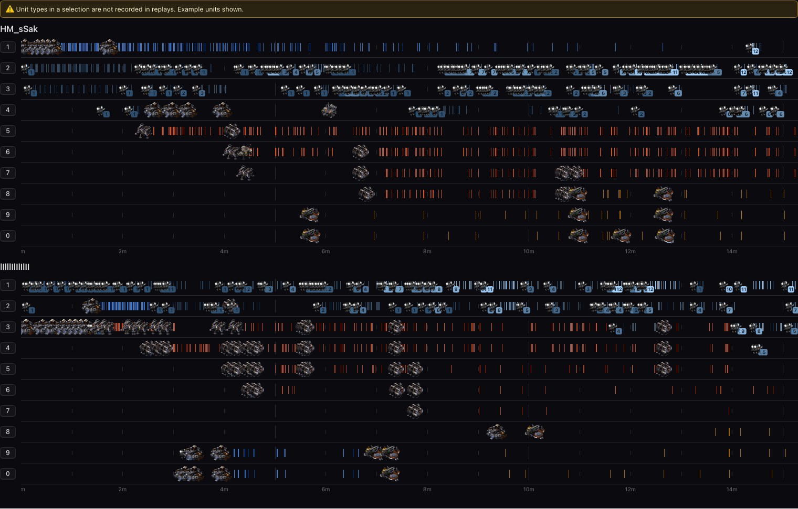
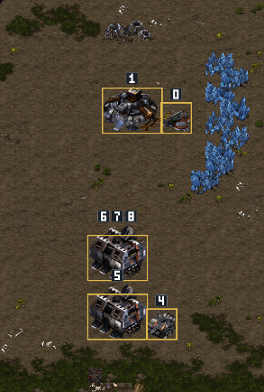
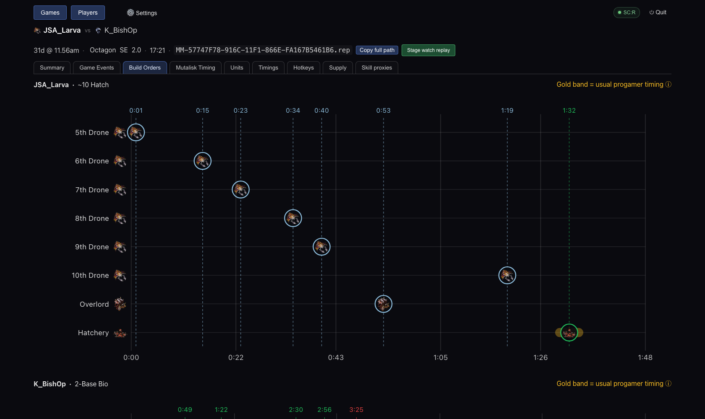
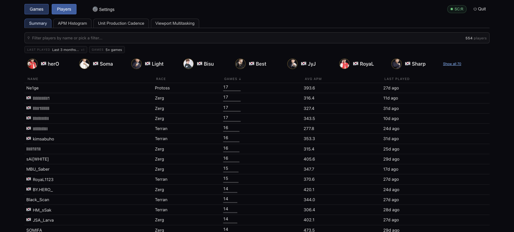
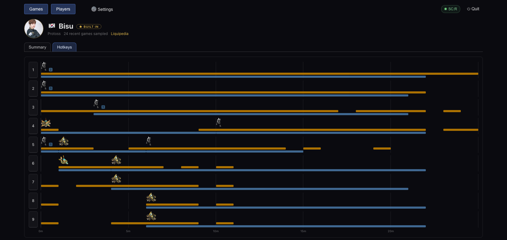
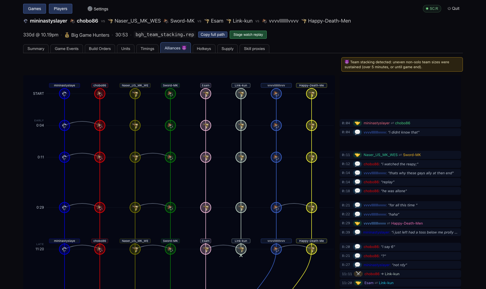

# screpdb

screpdb is an advanced Starcraft replay reporting tool.

[English](README.md) | [한국어](README.ko.md)

**▶️ [Try it in your browser](https://marianogappa.github.io/screpdb/)** — the full dashboard on sample replays, no install, runs entirely client side.

[](https://github.com/marianogappa/screpdb/releases)
[](LICENSE)
[](go.mod)
[](scripts/coverage.sh)
[](.github/workflows/bench-load.yml)

<!-- load-bench-start -->
<sub>28.88 ms/replay · corpus: 166 replays · GitHub-hosted 2-core runner · updated automatically on merge to main</sub>
<!-- load-bench-end -->

## Features
### Filtering and finding replays by high-level semantic features


### Game summary: each player's noteworthy semantic events and unit composition


### Rich game events browser with map overlays


### Hotkey intel: what each player keeps on which key, all game long


### …and the hotkeyed buildings drawn on the map where they were built


### Build order detection, de-duped and charted against usual progamer timings


### Built-in progamer profiles alongside the players in your own library


### Skill proxies: viewport multitasking, unit production cadence, first unit efficiency


### Per-player hotkey signature, including the built-in progamers


### Alliance timeline and team stacking detection on multiplayer melee games


## Installation

See [CHANGELOG.md](CHANGELOG.md) for release notes.

> ⚠️ **Security:** On **Windows**, screpdb runs its worker at **Low integrity** — the OS confines all of screpdb's writes to a single app-data folder, so even a compromised replay/map parser cannot write elsewhere on your machine (see [Security / I/O model](#security--io-model)). On **macOS and Linux** there is no OS sandbox yet: screpdb routes all its own I/O through in-process facades (writes confined to the app-data dir and the replays folder, no outbound network calls beyond user-initiated self-update), but these are best-effort guardrails rather than an OS boundary, so exercise judgement before running it.

<details>
<summary><strong>Windows</strong> — recommended: install with Scoop</summary>

**👉 Recommended: install with [Scoop](https://scoop.sh).** Open **PowerShell** and paste these commands:

```powershell
scoop install git   # required by 'scoop bucket add' (skip if you already have git)
scoop bucket add screpdb https://github.com/marianogappa/screpdb
scoop install screpdb
```

That's it. Now run **`screpdb-gui`** (the app opens in your browser), or `screpdb` for the CLI.

To upgrade later, just run:

```powershell
scoop update screpdb
```

> 💡 **Seeing an old version, or `install` fails on a missing file?** Your local
> copy of the bucket is a git clone that only refreshes on `scoop update`. Run
> `scoop update` (no package name) first to pull the latest manifest, then
> `scoop install screpdb` / `scoop update screpdb`.

Scoop is the happy path because it downloads without a browser, so Windows **won't** show the "unidentified developer" / SmartScreen warning, and upgrades are one command. Don't have Scoop yet? Install it first (one line, from [scoop.sh](https://scoop.sh)):

```powershell
Set-ExecutionPolicy -ExecutionPolicy RemoteSigned -Scope CurrentUser
irm get.scoop.sh | iex
```

<details>
<summary>Prefer a direct download? (expect a SmartScreen warning)</summary>

Grab **`screpdb-gui-windows-amd64.exe`** (the GUI; `screpdb-windows-amd64.exe` is the CLI) from the [Releases page](https://github.com/marianogappa/screpdb/releases) and double-click it.

The binaries are **not code-signed**, so on first launch Windows may warn you — none of these mean the binary is malicious:

- **SmartScreen "Windows protected your PC".** Click **More info → Run anyway**.
- **Microsoft Defender or third-party antivirus** may flag or silently quarantine the binary. Unsigned Go binaries that read files and make network requests are a known false-positive pattern. If the file vanishes from Downloads, check Defender's Protection History and restore it (or add an exclusion).
- **Enterprise machines** running AppLocker or Windows Defender Application Control may block it outright. There's no workaround without code signing.

The GUI binary is a windowed app with no console — if you dismiss the SmartScreen dialog it simply won't start and won't print an error. Scoop avoids all of this. You can also [build from source](#building-from-source).

> 💡 **Want the in-app Update button to work?** Put the `.exe` in a folder you can write to without admin rights — e.g. create `%LOCALAPPDATA%\Programs\screpdb\` and drop it there. screpdb can only replace its own binary when its folder is user-writable, so `C:\Program Files\` (needs admin) won't self-update. Otherwise the app just shows the download link instead.

</details>

The Scoop manifest lives at [`bucket/screpdb.json`](bucket/screpdb.json) and is bumped automatically on each release.

</details>

<details>
<summary><strong>Linux</strong> — one-line installer, or Homebrew</summary>

**Install with one command** (downloads the right binary, verifies it against the release's signed `SHA256SUMS`, drops it on your PATH):

```bash
curl -fsSL https://raw.githubusercontent.com/marianogappa/screpdb/main/install.sh | sh
```

Then run `screpdb`. To upgrade, re-run the same command (or use the in-app **Update** button).

> 🔍 **Don't pipe scripts you haven't read.** [`install.sh`](install.sh) is deliberately short and dependency-free so you can audit it in under a minute — it only downloads the binary for your OS/arch, checks it against the release's signed `SHA256SUMS`, and copies it to `~/.local/bin`. To read it first, then run your local copy:
>
> ```bash
> curl -fsSL https://raw.githubusercontent.com/marianogappa/screpdb/main/install.sh -o screpdb-install.sh
> less screpdb-install.sh   # audit it
> sh screpdb-install.sh
> ```

Prefer **[Homebrew](https://brew.sh) / Linuxbrew**?

```bash
brew install marianogappa/screpdb/screpdb   # upgrade later: brew update && brew upgrade screpdb
```

Or download the binary for your architecture from the [Releases page](https://github.com/marianogappa/screpdb/releases), make it executable, and move it onto your `PATH` — put it in a writable folder (not a Homebrew prefix) so the in-app **Update** button works:

```bash
chmod +x screpdb-linux-amd64                              # or screpdb-linux-arm64
mkdir -p ~/.local/bin && mv screpdb-linux-amd64 ~/.local/bin/screpdb
```

`~/.local/bin` is the one-line installer's default — any writable folder on your `PATH` works. Binaries fetched via curl/brew carry no quarantine flag, so they just run.

> 💡 screpdb self-updates only when its folder is user-writable and not owned by a package manager. A binary you run from `~/Downloads` or a Homebrew prefix won't auto-update — the app falls back to showing the download command instead.

</details>

<details>
<summary><strong>macOS</strong> — Homebrew, or one-line installer</summary>

**Install with [Homebrew](https://brew.sh):**

```bash
brew install marianogappa/screpdb/screpdb   # upgrade later: brew update && brew upgrade screpdb
```

Or the one-line installer (verifies it against the release's signed `SHA256SUMS`, installs to `~/.local/bin`):

```bash
curl -fsSL https://raw.githubusercontent.com/marianogappa/screpdb/main/install.sh | sh
```

Wary of piping to `sh`? It's the same [`install.sh`](install.sh) shown in the Linux section above — read it first, then run your local copy.

Then run `screpdb`. **No Gatekeeper "unidentified developer" block** with either method — `brew` and `curl` don't attach the quarantine attribute that triggers it, so the binary just runs (no notarization needed).

<details>
<summary>Prefer a direct download? (this one <em>does</em> hit Gatekeeper)</summary>

Download the binary for your architecture from the [Releases page](https://github.com/marianogappa/screpdb/releases), then clear the quarantine flag and move it onto your `PATH` — a writable folder (not a Homebrew prefix) so the in-app **Update** button works:

```bash
chmod +x screpdb-darwin-arm64                          # or screpdb-darwin-amd64
xattr -d com.apple.quarantine screpdb-darwin-arm64     # clear the browser-download quarantine
mkdir -p ~/.local/bin && mv screpdb-darwin-arm64 ~/.local/bin/screpdb
```

(Or right-click the binary → **Open** to approve it once.) `~/.local/bin` matches the one-line installer's default.

> 💡 screpdb self-updates only when its folder is user-writable and not owned by a package manager. A binary you run straight from `~/Downloads` or a Homebrew prefix won't auto-update — the app falls back to showing the download command instead.

</details>

</details>

### Building from source

You'll need Go 1.25.2 or later. Use `make build` (not a bare `go build`) so the embedded dashboard UI assets are rebuilt first:

```bash
git clone https://github.com/marianogappa/screpdb.git
cd screpdb
make build
```

## Uninstall

**1. Remove the binary**

| Installed with | Command |
| --- | --- |
| Scoop (Windows) | `scoop uninstall screpdb` |
| Homebrew (macOS/Linux) | `brew uninstall screpdb` |
| One-line installer / manual | Delete the binary you placed (e.g. `~/.local/bin/screpdb`) |

**2. Delete the data folder** (optional — skip this to keep your data for a future reinstall).

```bash
# Windows (PowerShell)
Remove-Item -Recurse -Force "$env:LOCALAPPDATA\screpdb"

# macOS
rm -rf "$HOME/Library/Application Support/screpdb"

# Linux
rm -rf "${XDG_CONFIG_HOME:-$HOME/.config}/screpdb"
```

## Developer features

<details>
<summary>MCP server and full OpenAPI — click to expand</summary>

- Server / API: `./screpdb dashboard` (also the default when run with no subcommand) starts the HTTP server and opens the dashboard UI. All UI functionality is exposed as a JSON API — [OpenAPI schema available](api/openapi/dashboard.v1.yaml). Run it headless as an API-only server (no UI, no browser) with `--headless`:

```bash
./screpdb dashboard --headless -p 8000
# then: curl http://localhost:8000/api/health
```

- MCP server: point an MCP client (Claude Desktop, Claude Code, Cursor, …) at your replays and ask questions in natural language about any game, player, matchup, build order, or event. A curated read-only subset of the API is reachable; nothing that changes local state is.

```bash
./screpdb mcp
```

If you want to build something on top of screpdb's API or MCP, let me know. I'm open to facilitating this, but I won't add untested features otherwise.

</details>

## Specification — how the numbers are computed

<details>
<summary>Every golden value — unit stats, build times, expert timings, detection thresholds — is generated from source and test-backed (see <code>SPECIFICATION.md</code>)</summary>

screpdb makes a lot of derived claims: "this is a **9 Pool**", "your Spawning
Pool was 6s late", "a Zealot takes 25.2s". Skeptical? Audit them.

[**SPECIFICATION.md**](SPECIFICATION.md) documents every golden value the app
relies on — unit names, build times, expert timings, costs, tech-tree rules,
detection thresholds, and more. It's:

- **Generated** from the Go source of truth (`go generate ./...`), so it can't drift from the code.
- **Test-backed** — CI fails if any value is wrong or the file is stale.

In short: not aspirational docs that rot, but a provably-accurate description of
what the app actually does.

</details>

<details>
<summary><strong>Verifying downloads</strong> — checksums + minisign signature</summary>

Each release publishes a `SHA256SUMS` file and a `SHA256SUMS.minisig` minisign signature alongside the binaries.

**Verify the checksum** (Linux/macOS):

```bash
sha256sum -c SHA256SUMS --ignore-missing
```

**Verify the checksum** (Windows PowerShell):

```powershell
Get-FileHash screpdb-windows-amd64.exe -Algorithm SHA256
# Compare the printed hash against the line in SHA256SUMS
```

**Verify the signature** (requires [minisign](https://jedisct1.github.io/minisign/)):

```bash
minisign -Vm SHA256SUMS -P 'RWS9gPPOydPD/tR8JBOelXKhif526NoAKY18dau7QHR4dqg84QMhJ5L/'
```

</details>

## Security / I/O model

screpdb minimizes its attack surface by routing all I/O through facades and keeping dependencies small (see [#135](https://github.com/marianogappa/screpdb/issues/135)). On **macOS and Linux** this is a best-effort, in-process guard; on **Windows** a Low-integrity worker adds a real OS write boundary.

<details>
<summary><strong>How the I/O model works</strong> — filesystem, Windows sandbox, network, self-update, enforcement</summary>

- **Filesystem** — all disk access goes through `internal/iofacade`, which permits reads/writes only within: a single per-OS **app-data directory** (`%LOCALAPPDATA%\screpdb` on Windows, `~/Library/Application Support/screpdb` on macOS, `$XDG_CONFIG_HOME/screpdb` on Linux) that holds settings, the Battle.net and game-asset caches, logs, crash reports, and extracted sample replays; and the configured replays folder (read replays, write "watch me" replays). A narrow, read-only exception walks up from the replays folder to find StarCraft's `CSettings.json`.
- **Windows OS sandbox** — on Windows the app splits into a Medium-integrity **launcher** and a **Low-integrity worker** ([#237](https://github.com/marianogappa/screpdb/issues/237)). The launcher marks the app-data directory Low-writable and relaunches the real worker at Low integrity; the worker keeps read-down access to replays anywhere but can only *write* into that one Low-labeled folder — every other write is refused by the OS, even from a compromised `screp`/`scmapanalyzer` parser. The launcher retains self-update (it must overwrite the install `.exe`) and brokers the single "watch me" write into the read-only replays folder on the worker's behalf. This does **not** stop a compromised parser from *reading* private files (Low integrity can read up-level); blocking reads needs AppContainer + a broker process, a deferred "Tier 2" follow-up.
- **Network** — the dashboard server binds to `localhost` only. The binary's outbound calls are confined to three sanctioned packages: **`internal/selfupdate`** ([#212](https://github.com/marianogappa/screpdb/issues/212)) queries GitHub Releases for self-update, verifying every byte against a minisign-signed `SHA256SUMS` (embedded public key) before any swap; **`internal/bnetfacade`** ([#317](https://github.com/marianogappa/screpdb/issues/317)) talks to SC:R's local web-api bridge (loopback only, path-prefixed to `/web-api/`) and downloads replays from `storage.googleapis.com` (allowlisted to the single path prefix `/starcraft-user-uploads-prod/S1-replays/`, with length + `seRS` magic-byte validation on every download); **`internal/netfacade`** houses localhost readiness probes.
- **Self-update** — updates are always user-initiated, never automatic. Package-manager installs (Scoop on Windows, Homebrew/Linuxbrew on macOS/Linux) and non-writable install directories are detected and excluded so the updater never fights `scoop update` / `brew upgrade` or needs elevation; those installs are pointed back at their package manager. The `curl | sh` installer drops into a writable dir (`~/.local/bin`), so in-app self-update keeps working there. Self-written binaries carry no macOS quarantine xattr / Windows Mark-of-the-Web, so Gatekeeper/SmartScreen don't re-prompt after an update.
- **Enforcement** — `TestNoDirectIOOutsideFacades` (in `internal/iofacade`) parses the whole module on every `go test` run and fails the build if any package reaches the filesystem or network directly instead of through the facades. `internal/selfupdate`, `internal/bnetfacade`, and `internal/winsandbox` (the Windows process-spawn / integrity-labeling / broker surface) are the documented exceptions.

On **macOS and Linux** this is a best-effort, in-process guard, not an OS sandbox: paths handed to trusted dependencies (the screp parser, scmapanalyzer) are opened inside those libraries, and the facade only constrains screpdb's own code. On **Windows** the Low-integrity worker adds a real OS write boundary on top of the same facades.

</details>

### I/O Safety Audit

The LLM that authors each change records a dated, one-line verdict on whether it could weaken the I/O rules above (see `AGENTS.md`); `TestIOSafetyAuditPresent` fails CI if the log is empty, and the enforcement test above stays the authoritative guard.

<!-- IO-AUDIT:START -->
```
2026-09-12  OK. Battle.net daily request cap removed. internal/bnetfacade/ratelimit.go drops bridgeDailyCap/downloadDailyCap and the two ErrBudgetExhausted refusals; the token buckets (1 per 2s, burst 12/6), the priority queues and the exponential cooldown on the server's own "Rate Limited" signal are unchanged and are now the whole of the enforcement. The day counters and their persisted file survive as reporting only, so the dashboard meter still shows requests today; the bnet status payload drops daily_cap and the tooltip drops the "/600". No new roots, hosts, endpoints, facade exemptions, enforcement-test weakening, or DetectorVersion bump: the same allowlisted loopback and GCS surfaces, reached at the same pace, with no ceiling that stopped legitimate work partway.
```

<details>
<summary>Older I/O safety audit entries (click to expand, five most recent)</summary>

```
2026-09-12  OK. CI workflow only (.github/workflows/ci.yml). The six-target cross-compile moves out of the `test` job into its own parallel `build` job, and both ubuntu jobs swap setup-go's go.sum-keyed cache (written only on a miss, so the compile cache froze at the last dependency bump) for an explicit commit-keyed actions/cache that restores on every run and is written only from main. The `test` job now runs `make ui-build` explicitly, because the internal/dashboard //go:embed of the gitignored frontend/build was previously satisfied as a side effect of `make cross-binaries`. No Go code and no application I/O is touched: no new roots, hosts, endpoints, facade exemptions, enforcement-test weakening, or DetectorVersion bump.
2026-09-12  OK. Battle.net cache redesign (#411/#417). The per-file payload caches (bnet_profiles/, bnet_game_results/) are replaced by two JSONL stores under the same already-registered app-data root: bnet/profiles.v2.jsonl (distilled records, atomic tmp+rename rewrite, 20k-entry budget, 90-day prune) and bnet/games.v2.jsonl (append-only game archive with compaction; never age-pruned because Battle.net only returns the last ~25 games). iofacade gains one primitive, AppendFile, resolve-guarded against the same root allowlist as WriteFile and covered by a new enforcement-path test; os.OpenFile stays on the forbidden-selector list. A keep-forever migration distils the legacy directories into the new stores at startup and then RemoveAlls them — deletion only, through iofacade, confined to the app-data root. The raw upstream payload is no longer persisted anywhere (parsed once at fetch, discarded). No new roots, hosts, endpoints, facade exemptions, enforcement-test weakening, or DetectorVersion bump (detection untouched; this is cache plumbing).
2026-09-12  OK. Identity badges on the list surfaces, plus manifest-attributed pro-pack entries. App-side: the games and players list endpoints now call the same in-memory badge resolver the detail endpoints already used (memoised fingerprint match plus the embedded scfingerprint registry) — no new reads, hosts or endpoints, and the badge collapsing and tooltip placement are frontend-only. Tooling-side: scripts/pro-pack gains a second attribution pass that reads each catalog identity's replay_manifest and copies those files from the operator-supplied -corpus dir into its own staging dir under os.TempDir(), the same dirs the existing harvest pass already stages into; it is a developer script outside the app's iofacade roots and ships no code into the binary. Liquipedia fetches are unchanged in kind and host, only two URLs corrected. No new roots, hosts, endpoints, facade exemptions, enforcement-test weakening, or DetectorVersion bump (the detector is untouched; the pack is stamped with the same 69).
2026-09-12  OK. Identity badges (#416). All new data comes from existing in-memory structures: the bnet profile cache (persist.BnetCache.FoundProfilesForToon reads headers already in memory, no disk), the embedded scfingerprint registry (compiled into the binary, no network), and fingerprint vectors already in the library snapshot. Removed the fpvec encode/decode round-trip (vectors stay []float64 in memory). No new roots, hosts, endpoints, facade exemptions, enforcement-test changes, or DetectorVersion bump.
2026-09-09  OK. Map cache goes downscaled JPEG with startup pruning (#409). iofacade gains two primitives, RemoveAll and ReadDir, both resolve-guarded against the same root allowlist as every other call and covered by a new enforcement-path test; os.RemoveAll/os.ReadDir stay on the forbidden-selector list. handlerGameAssetMap now caches game-assets/maps/v1/<key>.jpg (scmapanalyzer JPEG render, same app-data root, same tmp+rename write) instead of the lossless full-res PNG, and the hotkey composite renders its tile-rect crop per request via scmapanalyzer instead of reading the shared map cache — one fewer reader of cached bytes. New PruneGameAssetCache at dashboard startup deletes every non-current-version entry under game-assets/maps/ and game-assets/icons/ and caps the current map dir at 100 MB oldest-first — deletion only, through iofacade, confined to the game-assets subtree of the already-registered app-data root; failures are logged and ignored. No new roots, hosts, endpoints, facade exemptions, enforcement-test weakening, or DetectorVersion bump (images only, detection untouched).
```

</details>

<!-- IO-AUDIT:END -->


## License, Contributing & Acknowledgements

- This project is licensed under the MIT License. See the [LICENSE](LICENSE) file for details.
- Due to security safeguards I can no longer accept PRs or other code contributions, but please feel free to file an [Issue](https://github.com/marianogappa/screpdb/issues), and you're more than welcome to contribute non-code improvements.
- Built using the [github.com/icza/screp](https://github.com/icza/screp) library for StarCraft replay parsing. This project would have been impossible without [András Belicza](https://github.com/icza)'s work.
- Country flags on platforms that lack them (Windows) are drawn with the [Twemoji Country Flags](https://github.com/talkjs/country-flag-emoji-polyfill) font, whose artwork comes from [Twemoji](https://github.com/jdecked/twemoji) and is used under [CC BY 4.0](https://creativecommons.org/licenses/by/4.0/).
